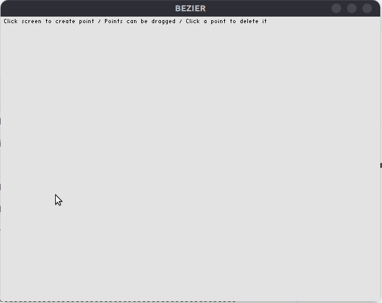

```bash
git clone git@github.com:tato/bezier.git
cd bezier
git submodule update --init --recursive
cmake .
make
./bezier
```
〰️〰️〰️〰️〰️〰️〰️〰️〰️〰️〰️〰️〰️〰️〰️〰️〰️〰️〰️〰️〰️〰️〰️〰️〰️〰️〰️〰️〰️〰️〰️〰️〰️〰️〰️〰️〰️〰️〰️〰️〰️〰️〰️〰️〰️〰️〰️〰️


〰️〰️〰️〰️〰️〰️〰️〰️〰️〰️〰️〰️〰️〰️〰️〰️〰️〰️〰️〰️〰️〰️〰️〰️〰️〰️〰️〰️〰️〰️〰️〰️〰️〰️〰️〰️〰️〰️〰️〰️〰️〰️〰️〰️〰️〰️〰️〰️
```
developed on march 2021 for the express purpose of chasing the spectre of discovery
using gltf, stb_easy_font and old opengl
tested only on ubuntu 20.04
released into the public domain
```
